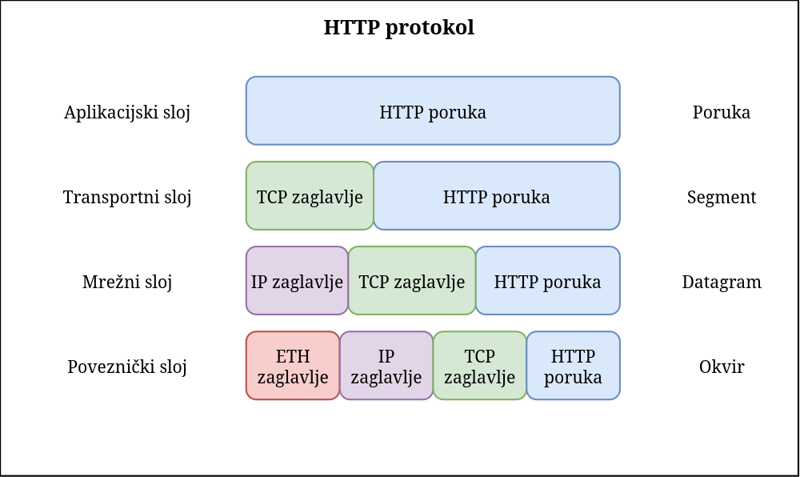
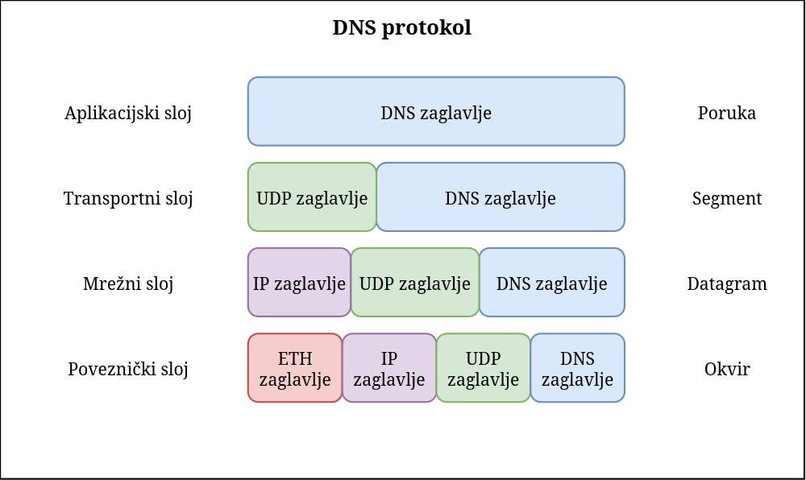

# Prva seminarska zadaća iz Mreža računala
## Hrvoje Kajba - IPS2-S-G13

---

### Pitanje 1.

**Pitanje:** 
Prođite kroz listu paketa koje ste snimili i proučite podate navedene u pojedinim stupcima liste. U stupcima source i destination navedene su adrese izvora i odredišta. Iza njih se nalazi stupac protocol u kojem su navedeni nazivi (kratice) protokola. Napravite popis protokola čije ste poruke snimili. Označite protokole čije su vam imena ili kratice od prije poznate.

**Odgovor:** 
Neki od protokola koje sam snimio su: **UDP**, TLSv1.2, TLSv1.3, **TCP**, SSDP, ARP, **DNS**, MDNS, **HTTP**, STP, ICPM i QUIC.

Od prije su mi poznati protokoli čija imena su napisana boldanim slovima.

---

### Pitanje 2.

**Pitanje:** 
U filtar za filtriranje prikaza unesite kraticu dns. Odaberite jednu od poruka dns protokola. Primijetite kako je za odabranu poruku prikazano pet redaka. Prvi redak označava cijeli primljeni okvir. Ostali redci označavaju zaglavlja protokola počevši od 2 sloja (zaglavlje fizičkog sloja nije proslijeđeno Wiresharku). Za odabranu DNS poruku navedite sve protokole u lancu učahurivanja.

**Odgovor:** 
U lancu učuharivanja se nalaze protokoli ovim redom:

| **Sloj** | **Protokol** |
| -------  | ------------ |
| 5.       | DNS          |
| 4.       | UDP          |
| 3.       | IPv4         |
| 2.       | Ethernet     |

---

### Pitanje 3.

**Pitanje:**
Na isti način kao u prethodnom zadatku sada u filtar za filtriranje prikaza unesite kraticu http. Odaberite
jednu od poruka http protokola. Ovisno o tipu poruke trebali biste vidjeti 5 ili 6 redaka. Za odabranu poruku navedite sve protokole koje koristi u lancu učahurivanja.

**Odgovor:**
U lancu učuharivanja se nalaze protokoli ovim redom:

| **Sloj** | **Protokol** |
| -------- | ------------ |
| 5.       | HTTP         |
| 4.       | TCP          |
| 3.       | IPv4         |
| 2.       | Ethernet     |

---

### Pitanje 4.

**Pitanje:**
Sada u filtar za filtriranje prikaza unesite kraticu icmp. Odaberite jednu od poruka icmp protokola. Za
odabranu poruku prikazano 4 redaka. Za odabranu poruku navedite sve protokole koje koristi u lancu učahurivanja.

**Odgovor:**
U lancu učuharivanja se nalaze protokoli ovim redom:

| **Sloj** | **Protokol** |
| -------- | ------------ |
| 4.       | ICMP         |
| 3.       | IPv4         |
| 2.       | Ethernet     |

---

### Pitanje 5.

**Pitanje:**
Usporedite koje su sličnosti i razlike kod prenošenja http, dns i icmp poruka. Koji od protokola su bili
zajednički za oba slučaja, a koji različiti? 

**Odgovor:**
Sva tri protokola imaju dva ista protokola u svom lancu učuharivanja, a to su *IPv4* i *Ethernet*. HTTP i DNS kao četvrti sloj imaju TCP ili UDP, dok ICMP ima manje slojeva, te je ICMP zapravo onaj protokol koji se nalazi na četvrtom sloju u svojem lancu učuharivanja.

HTTP koristi TCP zato što mu je bitan redoslijed u kojem sami podaci dođu, dok DNS koristi UDP zato što mu je bitnija brzina kojom ti podaci dolaze.

---

### Pitanje 6.

**Pitanje:**
Pogledajte zaglavlje protokola druge razine. Koliko (MAC) adresa vidite u zaglavlju? Probajte zaključiti zašto se koristi upravo toliko adresa? Čemu koja od njih služi?

**Odgovor:**
U poglavlju protokola druge razine (Ethernet) vidim dvije MAC adrese. Jedna služi da bi se identificirao izvor, a druga da bi se identificiralo odredište poruke na lokalnoj mreži. MAC adresa služi da bi se mogao identificirati svaki uređaj koji je spojen na lokalnoj mreži.

---

### Pitanje 7.

**Pitanje:**
Koliko bitova zauzimaju polje jedne adrese protokola druge razine? Koliko se različitih adresa može
zapisati s toliko bitova?

**Odgovor:**
Polje jedne adrese protokola druge razine (drugim riječima jedne MAC adrese) zauzima 48 bitova, tj. 6 * 8 bitova pošto se MAC adresa sastoji od šest heksadecimalnih brojeva. Ovime znamo da je moguće zapisati 2^48 jedinstvenih MAC adresa.

---

### Pitanje 8.

**Pitanje:** 
Pogledajte zaglavlje protokola treće razine. Koliko bitova zauzima adresa protokola 3 razine? Koliko različitih IP adresa može postojati s obzirom na to koliko se bitova koristi?

**Odgovor:**
Adresa protokola treće razine (IPv4 adresa) zauzima 32 bita, tj. 4 * 8 bitova pošto se IPv4 adresa sastoji od 4 bajta. Ovime znamo da je moguće zapisati 2^32 jedinstvenih IPv4 adresa.

---

### Pitanje 9.

**Pitanje:** 
U kojem je obliku zapisano zaglavlje HTTP-a, a u kojem IP-a (ASCII ili binarnom)?

**Odgovor:**

HTTP zaglavlje je zapisano u ASCII obliku:


```
GET /wireshark-labs/HTTP-wireshark-file1.html HTTP/1.1
Host: gaia.cs.umass.edu
User-Agent: Mozilla/5.0 (X11; Linux x86_64; rv:148.0) Gecko/20100101 Firefox/148.0
Accept: text/html,application/xhtml+xml,application/xml;q=0.9,*/*;q=0.8
```

dok su IP zaglavlja napisana u binarnom obliku:

```
0100 .... = Version: 4
.... 0101 = Header length: 20 bytes (5)
0000 00.. = Differentiated Services Codepoint: Default (0)
.... ..00 = Explicit Congestion Notification: Not ECN-Capable Transport (0)
```

---

### Pitanje 10.

**Pitanje:**
Za razne protokole koje ste snimili, skicirate primjere učahurivanja kako je to bilo prikazano na
predavanjima.

**Odgovor:**


